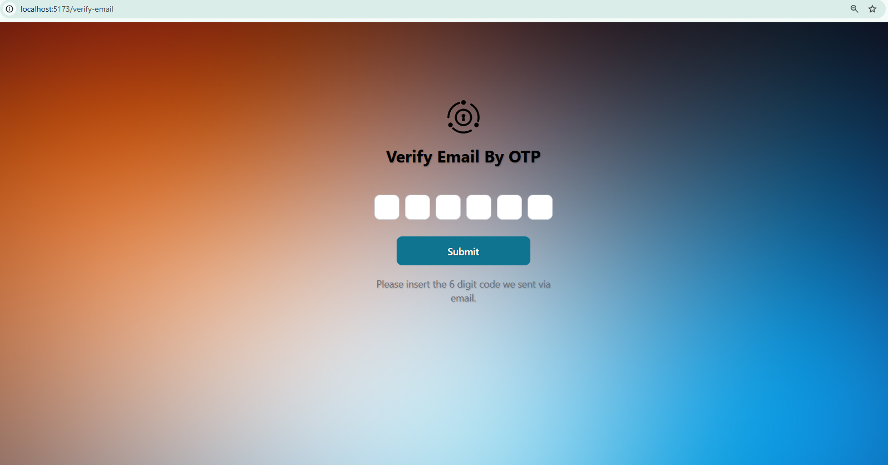
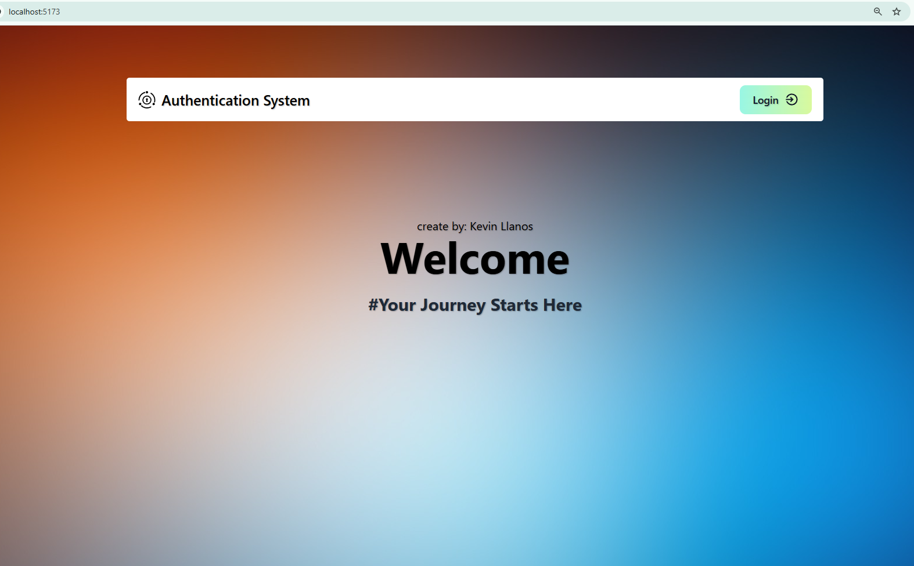
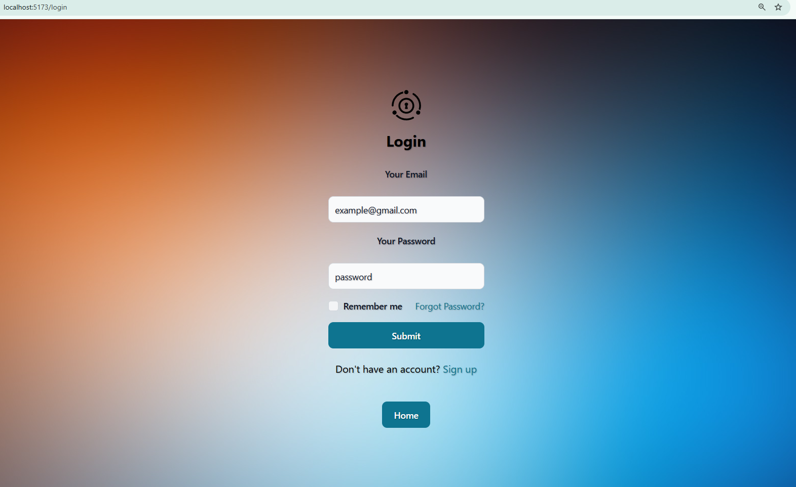
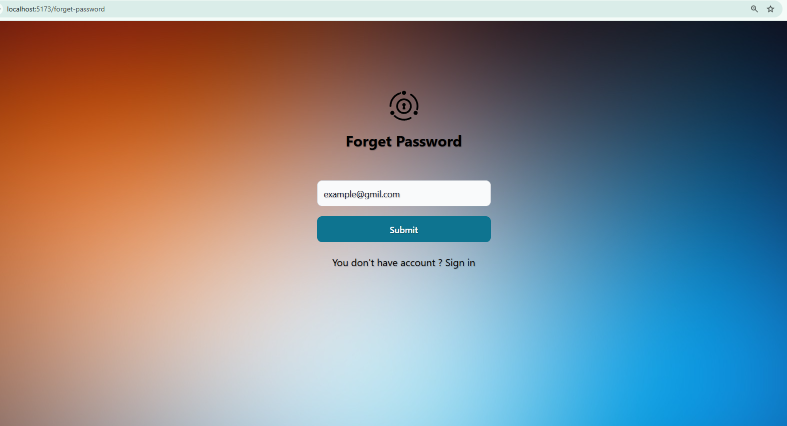
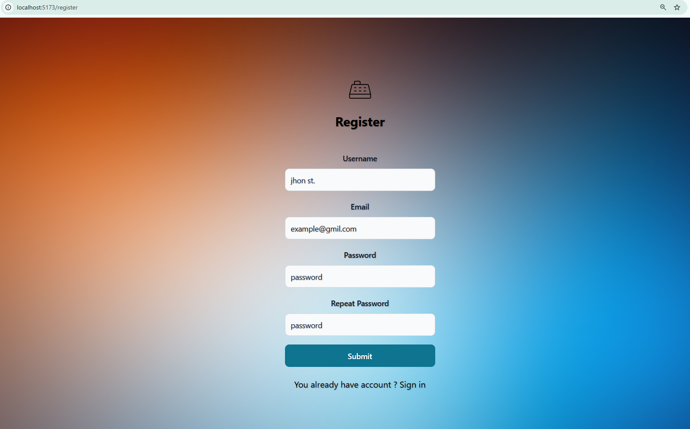

# React-Authenticate-OTP 🚀  
https://react-authenticate-otp.netlify.app/
## 1. Project Overview  
- The Authentication System features JWT-based login, verification, email requirement, password confirmation/reset, and a "page not found" error display. It focuses on secure user authentication, session management, access control, and preventing unauthorized access.

## 2. Tools & Technologies Used 🛠  
- **Front-End Technologies:** React, Flowbite, React Router DOM, TailwindCSS
- **Version Control:** Git, GitHub  
- **Containerization & Orchestration:** Docker
- **Testing:** Jest (for unit testing), Selenium WebDriver (for browser automation)
- **Authentication & Security:** Secure Login & Signup, OTP Verification, JWT Authentication
- **Deployment & Hosting: ** Netlify


## 3. Step-by-Step Implementation 🚀  
### Steps : Project Setup & Structure 🏗  

1. **Initialized the Project**  
   - Opened **Git Bash**, navigated to the project directory, and created a new folder:  
     ```sh
     mkdir authentication_otp && cd authentication_otp
     ```  

2. **Set Up React with Vite & Installed Essential Dependencies**  
   - Opened the terminal in the IDE and executed:  
     ```sh
     npm create vite@latest  
     npm install  
     npm install tailwindcss react-router-dom flowbite  
     ```  
   - Ensured a modern, fast, and responsive UI with **TailwindCSS & Flowbite**.  

3. **Established a Clean & Scalable Project Structure**  
   - Organized the codebase into modular folders for maintainability:  
     ```
     authentication_otp/  
     │── components/  
     │   └── common/  
     │── pages/  
     │   └── auth/  
     ```  
   - Ensured **separation of concerns** for better scalability and code reusability.  

4. **Created Core Component and Page Files for Enhanced Organization**  
   - Developed essential files within the `auth` folder:  
     - `login.js`  
     - `register.js`  
     - `reset-password.js`  
     - `verifyEmail.js`  
     - `PageNotFound.js`  
     - `AuthLayout.js`  
   - Implemented `index.js` in the `auth` folder for streamlined exports:  
     ```javascript
     export { default as LoginPage } from './login';
     export { default as AuthLayout } from './AuthLayout';
     export { default as RegisterPage } from './register';
     export { default as ForgetPasswordPage } from './forget-password';
     export { default as ResetPasswordPage } from './reset-password';
     export { default as VerifyOTPPage } from './verifyEmail';
     ```  
   - Created an `index.js` in the `components` folder for better organization:  
     ```javascript
     export { default as CustomNav } from './CustomNav';
     export { default as CustomInput } from './common/CustomInput';
     ```  

## CHALLENGES

- The primary challenges involved ensuring seamless interaction among various components through `main.jsx`, where I managed the import and export of all files.  
- I faced difficulties with alignment, design, and color selection to create a visually appealing application, often referencing other projects for inspiration.  
- Maintaining consistent spacing, including height, gaps, margins (mt, mb), and font styles required meticulous attention to detail, particularly with Flexbox layout.  
- Additionally, I encountered issues with routing throughout the project, which did not function as intended. I had to implement routers within the login component and use `main.jsx` as a reference to effectively organize the routing structure.  


## SCREENSHOTS






